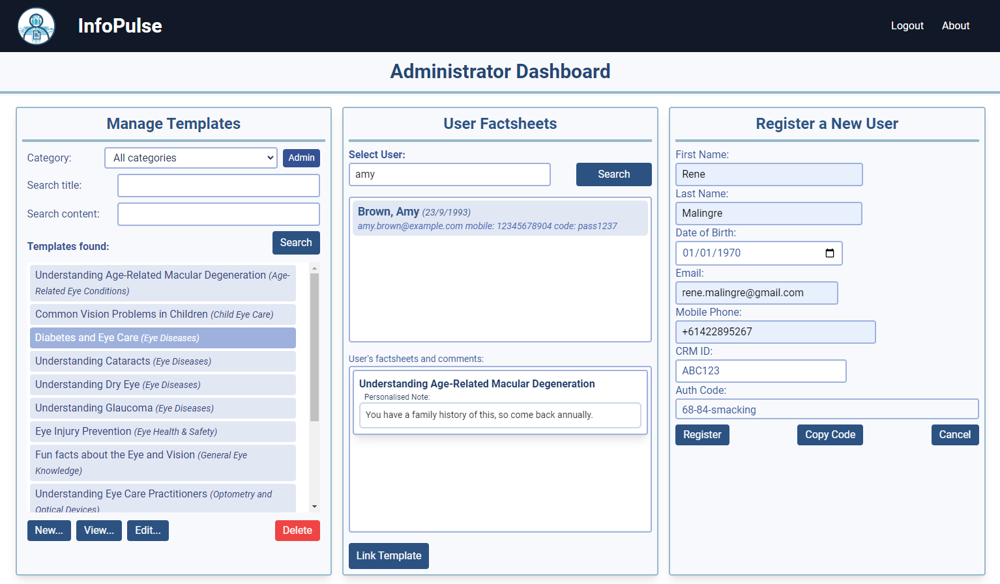
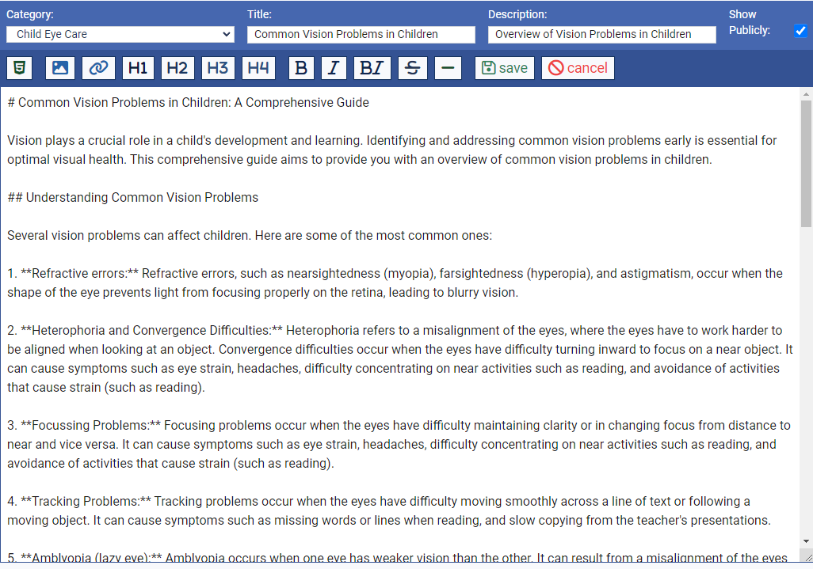
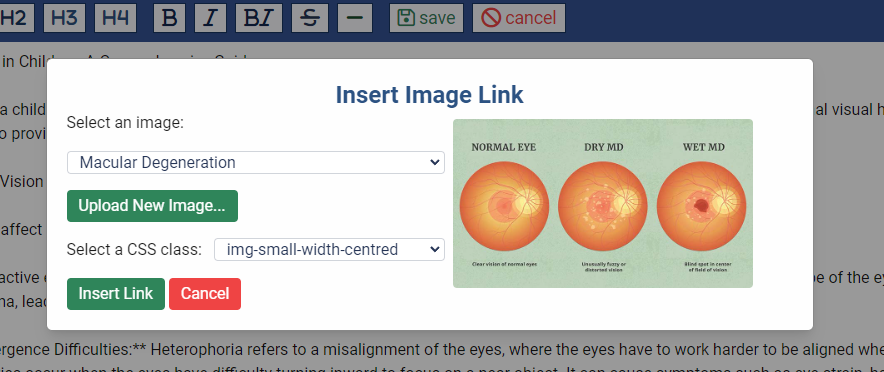
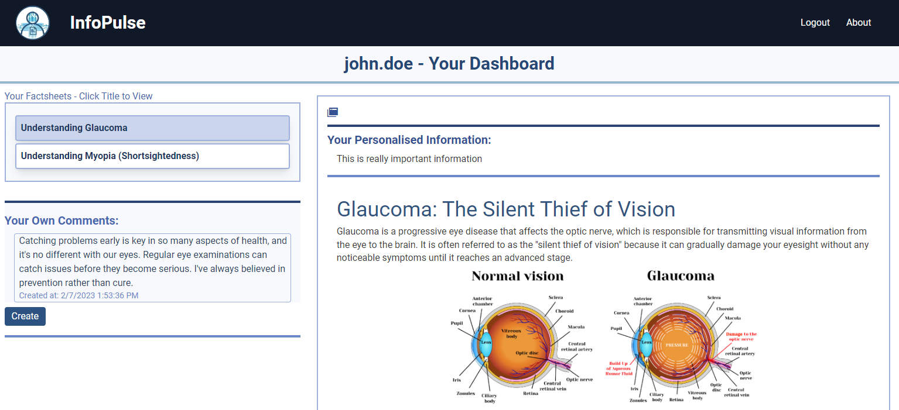

# InfoPulse

[](https://opensource.org/licenses/MIT)

[](https://github.com/prettier/prettier)

InfoPulse is a web application that allows health professionals to create and share information factsheets with their clients. It is designed to be a simple and easy to use platform for sharing information to clients, with a focus on privacy and security.

## Description

## Table of Contents

- [Business Case and Motivation](#business-case-and-motivation)
- [Screenshots](#screenshots)
- [Technologies Used](#technologies-used)
- [Installation](#installation)
- [Live Application](#live-application)
- [Credits](#credits)
- [License](#license)
- [Contributing](#contributing)
- [Questions](#questions)

## Business Case and Motivation

Providing users with information is an important part of many businesses. 40-80% of information and advice verbally given to users is immediately forgotten. In some fields such as health, following this information or advice can be very important.

### How it solves the problem

This application allows business to share information using factsheets chosen specifically for the user, with custom information being able to be appended, available in a browser through a secure login to the user's dashboard.

Factsheets are created by the business and can be shared with multiple users. They are created, edited and deleted by a logged-in administrator through a business dashboard using markdown format, and they can include images and other media via hyperlinks. The factsheets are converted to HTML and stored in a database, and are then retrieved and displayed to the user when they log in.

Users are enrolled in the system by the administrator, and are given a unique passphrase together with their registered email address which they use to log in and create their own username and password for future logging in. The passphrase is used to ensure that only the intended user can log in to the system.

Administrators can create, edit and delete factsheets.

Images can be uploaded by the administrator and are resized and compressed to reduce bandwidth usage and improve performance. Images are stored in the database and are referenced in the factsheets via a link to the images API endpoint. In the factsheet editing screen, image links are inserted into the markdown when the administrator chooses the image along with the image's CSS class for styling.

## Screenshots

### Landing Page


### Administrator Dashboard



### Factsheet Editor - Markdown Format



### Factsheet Editor - Image Tag Insertion



### User Dashboard - Factsheet List and Factsheet in HTML Format



## Technologies Used

This is a full-stack application using NodeJS for the server and Express for the web framework. The templating engine is Handlebars, and the database is MySQL. The application is hosted on Heroku, and the database is hosted on JawsDB. The application is styled using TailwindCSS. Various NodeJS packages are used for features such as authentication, file uploads, and sanitising HTML, and these are detailed below.

### NodeJS (npm) Packages

#### Standard Packages for NodeJS Server

- bcrypt: Hash passwords for storage in database
- connect-session-sequelize: Store sessions in database
- dotenv: Load environment variables from .env file
- express: Web framework for NodeJS
- express-session: Handle sessions for users
- handlebars: Templating engine for HTML
- mysql2: MySQL driver for NodeJS
- sequelize: ORM for MySQL
- tailwindcss: CSS framework

#### Packages used for features

- @octokit/rest: GitHub API, used to retrieve emojis
- dompurify: Sanitise HTML to prevent XSS attacks etc
- generate-passphrase: Generate a random passphrase for user authentication
- jsdom: Create a virtual DOM to aid in sanitising HTML with dompurify
- marked: Convert markdown to HTML
- marked-emoji: Convert emojis in markdown to HTML
- multer: Handle file uploads from the user
- sharp: Resize images and obtain metadata

#### Packages used for formatting and linting

- eslint: Linting for JavaScript
- prettier: Formatting for JavaScript

## Installation

### Setup on your machine

It is live on Heroku at the link below. To load it on your own machine for your own purposes, fork or copy the repository to your own machine. To install the necessary dependencies, run the following command in the terminal:
  
```bash
npm i
```

You must have MySQL installed on your machine or have access to a remote MySQL install.  Create a .env file in the root directory of the application.  Add the following lines to the .env file, replacing the values with your own, and other values as required for your MySQL installation:

```bash
DB_USER='your MySQL username'
DB_PASSWORD='your MySQL password'
DB_NAME='your custom database name'
```

### Creating the database

To create the database, open the terminal and navigate to the 'db' directory where you copied the repository. Open schema.sql in your preferred editor and update the database name to match the one you specified in the .env file.

Run the following command to open the MySQL shell:

```bash
mysql -u root -p
```

Enter your MySQL password when prompted.  Then run the following command to create the database:

```bash
source schema.sql
```

### Creating the database tables and relationships

To create the tables and relationships prior to starting the application server, run the following command in the terminal from the root directory of the application:

```bash
npm run seed
```

The server will generate the tables on startup if they do not already exist anyway, so this step is optional.

Be sure to seed the database with an Administrator user and known password.

### Starting the server

To start the server, run the following command in the terminal from the root directory of the application:

```bash
npm run start
```

### Usage

Navigate to [http://localhost:3001/](http://localhost:3001/) in your browser to access the application.

## Live Application

The demo application is live on Heroku at the following link:

[InfoPulse live on Heroku](https://secret-fortress-35525-524956ae3bdc.herokuapp.com/)

## Credits

[404 Image by storyset on Freepik](href="https://www.freepik.com/free-vector/oops-404-error-with-broken-robot-concept-illustration_7906233.htm#query=404&position=18&from_view=keyword&track=sph")

## License
  
This repository is licensed under the [MIT](https://opensource.org/licenses/MIT) license.
  
## Contributing
  
Contributions to this project will not be accepted, as this project is an assessment piece for a coding course, and it must be the project authors' own work. However, feel free to fork the repository and make your own changes.
  
## Questions
  
If you have any questions about the repository, open an issue on this repository.
